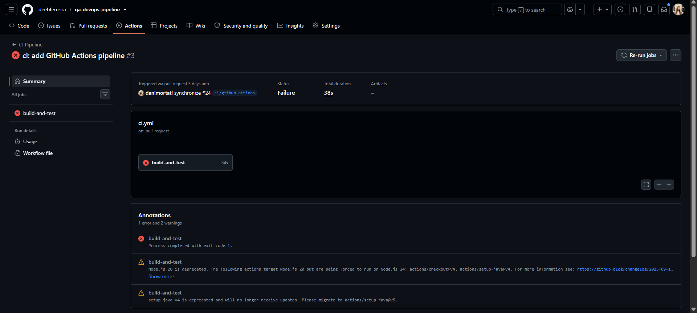
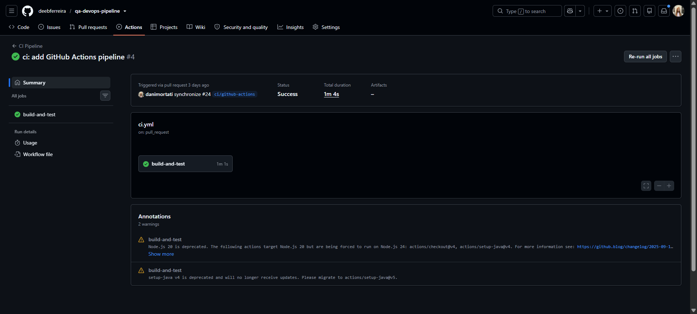

# QA Pipeline Lab

Projeto acadêmico desenvolvido para aplicar, na prática, conceitos de **Qualidade de Software, Automação de Testes e DevOps**.

A aplicação consiste em uma API REST para gerenciamento de tarefas, desenvolvida com **Java e Spring Boot**, com persistência em **PostgreSQL**, testes automatizados com **JUnit e REST Assured**, containerização com **Docker** e Integração Contínua utilizando **GitHub Actions**.

## 🎯 Objetivo

Simular um fluxo de desenvolvimento próximo de um ambiente real, passando por:

**Requisitos → Desenvolvimento → Testes → Automação → Pull Request → Pipeline CI → Validação**

O projeto contempla:

- API REST com CRUD de tarefas;
- Requisitos e critérios de aceite;
- Cenários positivos e negativos de teste;
- Testes manuais de API;
- Automação de testes;
- Git Flow com branches e Pull Requests;
- Docker e Docker Compose;
- PostgreSQL containerizado;
- Pipeline de Integração Contínua;
- Validação automática de testes e build Docker.

## 🛠️ Tecnologias

| Tecnologia | Utilização |
|---|---|
| Java 17 | Desenvolvimento da aplicação |
| Spring Boot | API REST |
| Spring Data JPA | Persistência |
| PostgreSQL | Banco de dados |
| Maven | Build e dependências |
| JUnit | Testes automatizados |
| REST Assured | Automação dos testes de API |
| Postman | Testes manuais |
| Docker | Containerização |
| Docker Compose | Aplicação + banco |
| Git / GitHub | Versionamento e colaboração |
| GitHub Actions | Integração Contínua |

## 📋 Funcionalidades

A API possui seis requisitos funcionais principais:

| Requisito | Funcionalidade | Endpoint |
|---|---|---|
| RF-001 | Criar tarefa | `POST /tasks` |
| RF-002 | Listar tarefas | `GET /tasks` |
| RF-003 | Consultar tarefa | `GET /tasks/{id}` |
| RF-004 | Atualizar tarefa | `PUT /tasks/{id}` |
| RF-005 | Alterar status | `PATCH /tasks/{id}/status` |
| RF-006 | Excluir tarefa | `DELETE /tasks/{id}` |

Os requisitos e critérios de aceite detalhados estão disponíveis em:

`docs/requirements/requirements.md`

## 🧪 Qualidade e testes

Foram definidos cenários de teste do **TS-001 ao TS-029**, contemplando cenários positivos, negativos e validações de regras de negócio.

A automação foi desenvolvida com **JUnit + REST Assured** e organizada por funcionalidade:

```text
src/test/java/com/qapipeline/api/

├── TaskCreationApiTest.java
├── TaskListingApiTest.java
├── TaskGetByIdApiTest.java
├── TaskUpdateApiTest.java
├── TaskStatusApiTest.java
└── TaskDeleteApiTest.java
```

Resultado da suíte:

```text
Tests run: 30
Failures: 0
Errors: 0
Skipped: 0

BUILD SUCCESS
```

São **29 cenários automatizados de API + 1 teste de contexto do Spring Boot**.

Para executar:

```bash
./mvnw clean test
```

No Windows:

```powershell
.\mvnw.cmd clean test
```

## 🐳 Docker

A aplicação e o PostgreSQL podem ser executados através do Docker Compose:

```text
Docker Compose
│
├── Spring Boot / Java 17
│
└── PostgreSQL
```

O projeto utiliza:

- `Dockerfile` com multi-stage build;
- `docker-compose.yml`;
- PostgreSQL 16;
- volume persistente;
- healthcheck do banco.

Para subir o ambiente:

```bash
docker compose up --build
```

A API ficará disponível em:

```text
http://localhost:8080/tasks
```

Para encerrar:

```bash
docker compose down
```

## 🔄 Integração Contínua

O projeto utiliza **GitHub Actions** para validar automaticamente as alterações.

O fluxo da pipeline é:

```text
Pull Request
     ↓
Checkout
     ↓
Java 17
     ↓
PostgreSQL
     ↓
Testes automatizados
     ↓
Build da imagem Docker
     ↓
PASS / FAIL
```

Além da execução bem-sucedida, foi realizado um **FAIL controlado** em um teste automatizado para comprovar que a pipeline identifica regressões.

Após a correção, uma nova execução foi realizada com sucesso:

```text
FAIL ❌ → Correção → PASS ✅
```

### Evidências da pipeline

**Pipeline detectando falha**

> 

**Pipeline após correção**

> 

## 🌿 Versionamento

O projeto utiliza uma estratégia baseada em Git Flow:

```text
main
  └── develop
       ├── feature/*
       ├── test/*
       ├── devops/*
       └── docs/*
```

As alterações são desenvolvidas em branches separadas e integradas através de **Pull Requests**, com validação automática pelo GitHub Actions.

Também foram utilizados recursos do GitHub como:

- Issues;
- Labels;
- Milestones;
- Projects;
- Wiki;
- Pull Requests;
- GitHub Actions.

## 📂 Estrutura

```text
qa-devops-pipeline/
├── .github/workflows/
├── docs/
├── src/
│   ├── main/
│   └── test/
├── Dockerfile
├── docker-compose.yml
├── pom.xml
└── README.md
```

## ▶️ Executando o projeto

Clone o repositório:

```bash
git clone <URL-DO-REPOSITORIO>
cd qa-devops-pipeline
```

Com Docker:

```bash
docker compose up --build
```

Ou execute os testes diretamente:

```bash
./mvnw clean test
```

## 📊 Resultados

Ao final do projeto foram alcançados:

- CRUD completo da API;
- PostgreSQL para persistência;
- 29 cenários de API automatizados;
- 30 testes executados com sucesso;
- ambiente containerizado;
- banco com volume persistente e healthcheck;
- pipeline CI automatizada;
- testes executados automaticamente em Pull Requests;
- build automático da imagem Docker;
- demonstração de `FAIL → correção → PASS`;
- fluxo colaborativo utilizando Git e GitHub.

## 👩‍💻 Autoras

**Daniele Mortati**  
**Débora Ferreira**

Projeto desenvolvido como atividade acadêmica do curso de **Análise e Desenvolvimento de Sistemas**.